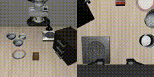

# Mirror-VLA

**Repository:** [https://github.com/TonyLeng1314/MirrorVLA](https://github.com/TonyLeng1314/MirrorVLA)

Mirror-VLA addresses the problem that **third-view VLAs fail in mirror (flipped) settings**. We propose **MirrorBench**, a benchmark based on [LIBERO](https://github.com/Lifelong-Robot-Learning/LIBERO), together with a **lightweight discriminator** and **Mirror-VLA**. Under this setup, success rates in normal conditions stay similar, while success under mirror conditions is **greatly improved**.

This repository is a secondary development based on [VLA-Adapter](https://github.com/OpenHelix-Team/VLA-Adapter), for extensions and experiments around [VLA-Adapter: An Effective Paradigm for Tiny-Scale Vision-Language-Action Model](https://arxiv.org/abs/2509.09372).

---

## 📋 README Sections (Where to Find Them in This Repo)


| Section                            | Description                                            | In This README                                                                                                                                           |
| ---------------------------------- | ------------------------------------------------------ | -------------------------------------------------------------------------------------------------------------------------------------------------------- |
| **Project overview**               | What the project is and what it does                   | See above                                                                                                                                                |
| **Upstream relation**              | Which project it is based on and what changed          | See "Acknowledgment" and "Differences from Upstream" below                                                                                               |
| **Environment & install**          | How to install dependencies and set up the environment | See [Environment & Installation](#-environment--installation) below                                                                                      |
| **Quick start / usage**            | Minimal steps to run training or inference             | See [README_adapter.md](README_adapter.md)                                                                                                               |
| **Data preparation**               | Dataset download and path setup                        | See [README_adapter.md](README_adapter.md#pencil-data-preparation)                                                                                       |
| **Mirror augmentation**            | Augmentation modes for three-view simulation           | See [Mirror augmentation](#-mirror-augmentation) below                                                                                                   |
| **Training VLA backbone**          | Training with augmode condition (example)              | See [Training the VLA backbone](#-training-the-vla-backbone) below                                                                                       |
| **Lightweight augmode recognizer** | Data generation and training the discriminator         | See [Training the lightweight augmentation recognizer](#-training-the-lightweight-augmentation-recognizer) below                                         |
| **Evaluating VLA on MirrorBench**  | Four-quadrant eval with augmode predictor              | See [Evaluating the full VLA on MirrorBench](#-evaluating-the-full-vla-on-mirrorbench) below                                                             |
| **Test results**                   | Baseline success rates on MirrorBench                  | See [Test results](#-test-results) below                                                                                                                 |
| **Demo**                           | Video demos                                            | See [Demo](#-demo) below                                                                                                                                 |
| **Training & evaluation**          | Commands, configs, and script locations                | See [README_adapter.md](README_adapter.md#fire-training-for-different-configurations) and [Inference / Eval](README_adapter.md#mechanical_arm-inference) |
| **Acknowledgment**                 | Credits to upstream and related projects               | See "Acknowledgment" below                                                                                                                               |
| **License**                        | MIT                                                    | See root [LICENSE](LICENSE)                                                                                                                              |


---

## 🛠 Environment & Installation

The environment for this repository follows [VLA-Adapter](https://github.com/OpenHelix-Team/VLA-Adapter). Set up your environment as follows:

```bash
# Create and activate conda environment
conda create -n vla-adapter python=3.10.16 -y
conda activate vla-adapter

# Install PyTorch (pick the command for your system: https://pytorch.org/get-started/locally/)
pip install torch==2.2.0 torchvision==0.17.0 torchaudio==2.2.0

# Clone this repo (or VLA-Adapter) and install in editable mode
git clone https://github.com/OpenHelix-Team/VLA-Adapter.git
cd VLA-Adapter
pip install -e .

pip install packaging ninja
ninja --version; echo $?   # Should return exit code 0

# Flash Attention 2 for training (https://github.com/Dao-AILab/flash-attention)
pip install "flash-attn==2.5.5" --no-build-isolation
# If installation fails, try: pip cache remove flash_attn
# Or download a prebuilt wheel from: https://github.com/Dao-AILab/flash-attention/releases/tag/v2.5.5
# Choose the .whl matching your CUDA version (nvidia-smi). Example:
# pip install flash_attn-2.5.5+cu122torch2.2cxx11abiFALSE-cp310-cp310-linux_x86_64.whl
```

---

## 🙏 Acknowledgment

**This repository is developed on top of [VLA-Adapter](https://github.com/OpenHelix-Team/VLA-Adapter). We thank OpenHelix-Team and the original authors for their work.**

- Upstream repo: [https://github.com/OpenHelix-Team/VLA-Adapter](https://github.com/OpenHelix-Team/VLA-Adapter)
- Paper: [VLA-Adapter: An Effective Paradigm for Tiny-Scale Vision-Language-Action Model](https://arxiv.org/abs/2509.09372)
- Project page: [https://vla-adapter.github.io/](https://vla-adapter.github.io/)
- HuggingFace: [https://huggingface.co/VLA-Adapter](https://huggingface.co/VLA-Adapter)

This repo extends and modifies the original implementation for learning and research. If you use this code or build on VLA-Adapter, please cite the original paper (see "Citation" below).

---

## 🔧 Differences from Upstream

This repo adds custom experiments and engineering scripts (e.g. Slurm job scripts, data generation and evaluation pipelines) on top of VLA-Adapter. For exact features and usage, refer to the code and [README_adapter.md](README_adapter.md).

---

## 🪞 Mirror augmentation

**Mirror augmentation** is an augmentation benchmark proposed in this project. It is applicable to all simulation setups that use a three-view testing platform.

There are four augmentation modes (*augmodes*):


| Mode  | Description                                   |
| ----- | --------------------------------------------- |
| **1** | Original (no mirroring)                       |
| **2** | Horizontally flip input images only           |
| **3** | Mirror-flip input actions only                |
| **4** | Both 2 and 3 (flip images and mirror actions) |

Modes **3** and **4** are extremely difficult in practice—success under these settings is rare and often close to impossible without explicit handling (e.g. augmode conditioning).

---

## 🏋️ Training the VLA backbone

The following example trains the VLA backbone with **augmode conditioning**. The action head applies augmode-specific handling, and the dataloader **automatically balances** the training data across all augmodes (by default, a uniform distribution over all four augmodes).

Replace `YOUR_WANDB_ENTITY` and paths as needed, then run from the repository root (e.g. after `cd /path/to/this/repo`):

```bash
data_name=libero_spatial_no_noops
num_steps_before_decay=25000
max_steps=$((num_steps_before_decay + 5))
export WANDB_MODE=online

torchrun --standalone --nnodes 1 --nproc-per-node 4 vla-scripts/finetune.py \
  --vlm_path pretrained_models/prism-qwen25-extra-dinosiglip-224px-0_5b \
  --config_file_path pretrained_models/configs \
  --data_root_dir data/libero \
  --dataset_name $data_name \
  --run_root_dir outputs \
  --use_film False \
  --num_images_in_input 1 \
  --use_proprio True \
  --use_lora True \
  --use_fz False \
  --use_minivlm True \
  --image_aug True \
  --num_steps_before_decay $num_steps_before_decay \
  --max_steps $max_steps \
  --save_freq 5000 \
  --save_latest_checkpoint_only False \
  --merge_lora_during_training True \
  --batch_size 16 \
  --grad_accumulation_steps 1 \
  --learning_rate 2e-4 \
  --lora_rank 64 \
  --use_pro_version True \
  --wandb_entity "YOUR_WANDB_ENTITY" \
  --wandb_project "$data_name" \
  --run_id_note VLA-Adapter--spatial--$(date +%Y%m%d_%H%M%S) \
  --wandb_mode online \
  --mask_cam None \
  --enable_four_quadrant_input True \
  --use_aug_mode_condition True
```

- `**--use_aug_mode_condition True**` enables augmode conditioning; the action head and dataloader handle the four augmodes as described above.
- For a full Slurm example, see `submit/train_spatial.slurm`.

---

## 🔬 Training the lightweight augmentation recognizer

A lightweight **augmode recognizer** (discriminator) predicts which augmentation mode was applied from observation. Training it is a two-step process: generate probe data, then train the predictor.

### Data generation

The following script generates **probe data** used to train the lightweight discriminator. Run from the repository root; set `PYTHONPATH` to include LIBERO if needed (e.g. your LIBERO install path).

```bash
python scripts/generate_augmode_probe_data.py \
  --task_suites all \
  --output_dir data/libero_augmode_probe_flow \
  --probe_steps 30 \
  --probe_delta 0.2 \
  --num_initial_states_per_task 2 \
  --image_res 256 \
  --seed 42
```

- Output is written to `--output_dir` (e.g. `data/libero_augmode_probe_flow`). Use this directory as the data source for the next step.

### Training the discriminator

After probe data is generated, train the augmode predictor (discriminator) with:

```bash
DATA_ROOT="data/libero_augmode_probe_flow/libero_10"
OUTPUT_DIR="outputs/augmode_predictor"

python vla-scripts/train_augmode_predictor.py \
  --data_root "$DATA_ROOT" \
  --output_dir "$OUTPUT_DIR" \
  --batch_size 2048 \
  --epochs 64 \
  --lr 1e-3 \
  --val_ratio 0.2 \
  --num_workers 4 \
  --flow_clip 20.0 \
  --wandb_project augmode_predictor \
  --wandb_mode online \
  --seed 42
```

- `DATA_ROOT` must point to probe data that contains `index.json` and per-suite subdirectories (e.g. a subset like `libero_10` under the directory produced by the data-generation script).

---

## 📊 Evaluating the full VLA on MirrorBench

The evaluation script runs the full VLA on **MirrorBench** and **automatically enables four-quadrant evaluation**. The augmode predictor (discriminator) is used at test time; its checkpoint and hyperparameters (**probe_steps**, **probe_delta**, **flow_clip**) must match the setup used when training the predictor.

Set your VLA checkpoint path and, if needed, `PYTHONPATH` (e.g. to include LIBERO), then run from the repository root:

```bash
# Example checkpoint path (replace with your trained VLA checkpoint)
checkpoint_path="outputs/configs+libero_spatial_no_noops+b16+lr-0.0002+lora-r64+dropout-0.0--image_aug--VLA-Adapter--spatial--20260310_105353--25000_chkpt"

python experiments/robot/libero/run_libero_eval_quadrant.py \
  --use_proprio True \
  --num_images_in_input 1 \
  --use_film False \
  --pretrained_checkpoint $checkpoint_path \
  --use_pro_version True \
  --flip_ratio 1.0 \
  --flip_type horizontal \
  --cat_wrist True \
  --mask_cam None \
  --enable_view_fusion False \
  --view_fusion_invert False \
  --num_trials_per_task 15 \
  --task_suite_name libero_spatial \
  --enable_quadrant_eval True \
  --use_aug_mode_condition True \
  --use_aug_mode_predictor True \
  --aug_mode_predictor_checkpoint outputs/augmode_predictor/best.pt \
  --probe_steps 30 \
  --probe_delta 0.2 \
  --flow_clip 20.0
```

- `**--enable_quadrant_eval True**`: turns on four-quadrant testing.
- `**--aug_mode_predictor_checkpoint**`, `**--probe_steps**`, `**--probe_delta**`, `**--flow_clip**`: must match the discriminator training configuration.

---

## 📈 Test results

Success rates on **LIBERO Spatial** under the four MirrorBench conditions: **Normal**, **Image Flip**, **Action Flip**, and **Both Flip** (50 trials per task for the first table, 15 for the second).

### Baseline (original VLA-Adapter)

Standard training without four-quadrant / augmode conditioning.


| Task                                                                                     | Normal              | Image Flip          | Action Flip      | Both Flip        |
| ---------------------------------------------------------------------------------------- | ------------------- | ------------------- | ---------------- | ---------------- |
| pick up the black bowl between the plate and the ramekin and place it on the plate       | 50/50 (100.0%)      | 0/50 (0.0%)         | 0/50 (0.0%)      | 0/50 (0.0%)      |
| pick up the black bowl next to the ramekin and place it on the plate                     | 46/50 (92.0%)       | 18/50 (36.0%)       | 0/50 (0.0%)      | 0/50 (0.0%)      |
| pick up the black bowl from table center and place it on the plate                       | 47/50 (94.0%)       | 32/50 (64.0%)       | 0/50 (0.0%)      | 0/50 (0.0%)      |
| pick up the black bowl on the cookie box and place it on the plate                       | 48/50 (96.0%)       | 31/50 (62.0%)       | 0/50 (0.0%)      | 0/50 (0.0%)      |
| pick up the black bowl in the top drawer of the wooden cabinet and place it on the plate | 39/50 (78.0%)       | 0/50 (0.0%)         | 0/50 (0.0%)      | 0/50 (0.0%)      |
| pick up the black bowl on the ramekin and place it on the plate                          | 0/50 (0.0%)         | 0/50 (0.0%)         | 0/50 (0.0%)      | 0/50 (0.0%)      |
| pick up the black bowl next to the cookie box and place it on the plate                  | 50/50 (100.0%)      | 16/50 (32.0%)       | 0/50 (0.0%)      | 0/50 (0.0%)      |
| pick up the black bowl on the stove and place it on the plate                            | 44/50 (88.0%)       | 33/50 (66.0%)       | 0/50 (0.0%)      | 0/50 (0.0%)      |
| pick up the black bowl next to the plate and place it on the plate                       | 47/50 (94.0%)       | 0/50 (0.0%)         | 0/50 (0.0%)      | 0/50 (0.0%)      |
| pick up the black bowl on the wooden cabinet and place it on the plate                   | 47/50 (94.0%)       | 15/50 (30.0%)       | 0/50 (0.0%)      | 0/50 (0.0%)      |
| **Overall**                                                                              | **418/500 (83.6%)** | **145/500 (29.0%)** | **0/500 (0.0%)** | **0/500 (0.0%)** |


### Baseline trained with four-quadrant data

Same model trained with four-quadrant (augmode) data but without augmode conditioning at test time (15 trials per task).


| Task                                                                                     | Normal           | Image Flip       | Action Flip      | Both Flip        |
| ---------------------------------------------------------------------------------------- | ---------------- | ---------------- | ---------------- | ---------------- |
| pick up the black bowl between the plate and the ramekin and place it on the plate       | 0/15 (0.0%)      | 0/15 (0.0%)      | 0/15 (0.0%)      | 0/15 (0.0%)      |
| pick up the black bowl next to the ramekin and place it on the plate                     | 0/15 (0.0%)      | 0/15 (0.0%)      | 0/15 (0.0%)      | 0/15 (0.0%)      |
| pick up the black bowl from table center and place it on the plate                       | 1/15 (6.7%)      | 0/15 (0.0%)      | 0/15 (0.0%)      | 0/15 (0.0%)      |
| pick up the black bowl on the cookie box and place it on the plate                       | 0/15 (0.0%)      | 0/15 (0.0%)      | 0/15 (0.0%)      | 0/15 (0.0%)      |
| pick up the black bowl in the top drawer of the wooden cabinet and place it on the plate | 0/15 (0.0%)      | 0/15 (0.0%)      | 0/15 (0.0%)      | 0/15 (0.0%)      |
| pick up the black bowl on the ramekin and place it on the plate                          | 0/15 (0.0%)      | 0/15 (0.0%)      | 0/15 (0.0%)      | 0/15 (0.0%)      |
| pick up the black bowl next to the cookie box and place it on the plate                  | 0/15 (0.0%)      | 0/15 (0.0%)      | 0/15 (0.0%)      | 0/15 (0.0%)      |
| pick up the black bowl on the stove and place it on the plate                            | 0/15 (0.0%)      | 0/15 (0.0%)      | 0/15 (0.0%)      | 0/15 (0.0%)      |
| pick up the black bowl next to the plate and place it on the plate                       | 0/15 (0.0%)      | 0/15 (0.0%)      | 0/15 (0.0%)      | 0/15 (0.0%)      |
| pick up the black bowl on the wooden cabinet and place it on the plate                   | 0/15 (0.0%)      | 0/15 (0.0%)      | 0/15 (0.0%)      | 0/15 (0.0%)      |
| **Overall**                                                                              | **1/150 (0.7%)** | **0/150 (0.0%)** | **0/150 (0.0%)** | **0/150 (0.0%)** |


### Ours (ground-truth augmode at test time)

Mirror-VLA with augmode conditioning, evaluated using **ground-truth** augmode at test time (15 trials per task). This is an upper bound when the augmentation mode is known.


| Task                                                                                     | Normal              | Image Flip          | Action Flip        | Both Flip           |
| ---------------------------------------------------------------------------------------- | ------------------- | ------------------- | ------------------ | ------------------- |
| pick up the black bowl between the plate and the ramekin and place it on the plate       | 13/15 (86.7%)       | 12/15 (80.0%)       | 0/15 (0.0%)        | 0/15 (0.0%)         |
| pick up the black bowl next to the ramekin and place it on the plate                     | 14/15 (93.3%)       | 13/15 (86.7%)       | 9/15 (60.0%)       | 8/15 (53.3%)        |
| pick up the black bowl from table center and place it on the plate                       | 15/15 (100.0%)      | 15/15 (100.0%)      | 2/15 (13.3%)       | 3/15 (20.0%)        |
| pick up the black bowl on the cookie box and place it on the plate                       | 15/15 (100.0%)      | 15/15 (100.0%)      | 5/15 (33.3%)       | 6/15 (40.0%)        |
| pick up the black bowl in the top drawer of the wooden cabinet and place it on the plate | 13/15 (86.7%)       | 13/15 (86.7%)       | 0/15 (0.0%)        | 0/15 (0.0%)         |
| pick up the black bowl on the ramekin and place it on the plate                          | 0/15 (0.0%)         | 0/15 (0.0%)         | 0/15 (0.0%)        | 0/15 (0.0%)         |
| pick up the black bowl next to the cookie box and place it on the plate                  | 13/15 (86.7%)       | 14/15 (93.3%)       | 1/15 (6.7%)        | 1/15 (6.7%)         |
| pick up the black bowl on the stove and place it on the plate                            | 15/15 (100.0%)      | 15/15 (100.0%)      | 4/15 (26.7%)       | 6/15 (40.0%)        |
| pick up the black bowl next to the plate and place it on the plate                       | 14/15 (93.3%)       | 14/15 (93.3%)       | 0/15 (0.0%)        | 0/15 (0.0%)         |
| pick up the black bowl on the wooden cabinet and place it on the plate                   | 13/15 (86.7%)       | 13/15 (86.7%)       | 1/15 (6.7%)        | 1/15 (6.7%)         |
| **Overall**                                                                              | **125/150 (83.3%)** | **124/150 (82.7%)** | **22/150 (14.7%)** | **25/150 (16.7%)**  |


---

## 🎬 Demo

At the start of each evaluation run we perform a **unified y-axis translation** so the discriminator can determine whether the current setting is mirrored. The clips below show Normal and Image Flip conditions.

**Normal** — pick up the black bowl between the plate and the ramekin and place it on the plate:



**Image Flip** — pick up the black bowl on the wooden cabinet and place it on the plate:


---

## 📖 Full Documentation

**For installation, environment setup, data preparation, training, inference, and evaluation, see:**

👉 **[README_adapter.md](README_adapter.md)**

It includes the original VLA-Adapter Quick Start, LIBERO/CALVIN data setup, training configs for different VRAM sizes, and inference/evaluation steps.

---

## 📄 License

This project is licensed under the **MIT License**. See the [LICENSE](LICENSE) file in the repository root.